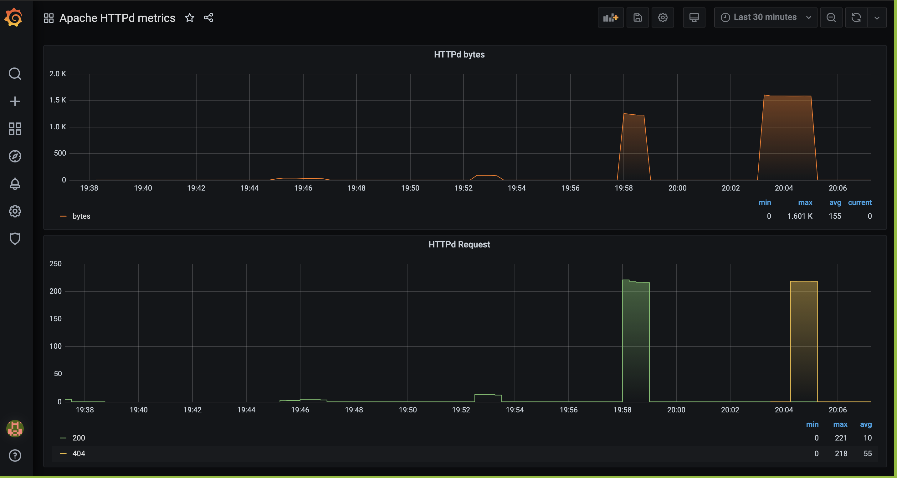

# httpd_exporter

Prometheus exporter for monitoring http servers from logs.

It extracts data from http logs and export to prometheus.

### Requirements

- python 3.6 +

## Usage

- Clone the repo
- Run `docker-compose up`

## Grafana Dashboard

